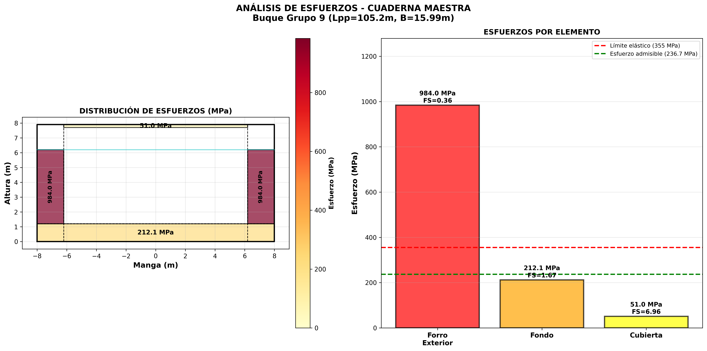

# ENTREGA 4: Análisis de Resistencia Estructural - Cuaderna Maestra

## Buque de Carga General - Grupo 9

**Fecha:** Noviembre 2025  
**Asignatura:** Estructuras Navales  
**Institución:** FNB

---

## 📋 RESUMEN EJECUTIVO

Este proyecto presenta el análisis completo de resistencia estructural de la cuaderna maestra del Buque Grupo 9, un buque de carga general con las siguientes características:

- **Eslora entre perpendiculares (Lpp):** 105.20 m
- **Manga (B):** 15.99 m
- **Puntal (D):** 7.90 m
- **Calado (T):** 6.20 m
- **Material:** Acero AH36
- **Normativa:** DNV-RU-SHIP Part 3

---

## 🎯 OBJETIVOS

1. ✅ Calcular las presiones de diseño (hidrostáticas y de carga)
2. ✅ Analizar los esfuerzos en elementos estructurales principales
3. ✅ Verificar el cumplimiento de la normativa DNV
4. ✅ Generar planos de distribución de cargas y esfuerzos
5. ✅ Proporcionar recomendaciones de diseño

---

## 📁 ESTRUCTURA DEL PROYECTO

```
ENTREGA 4/
├── README.md                                    # Este archivo
├── RESUMEN_EJECUTIVO.md                        # Resumen ejecutivo del análisis
├── ANALISIS_RESISTENCIA.md                     # Análisis detallado de resistencia
├── DOCUMENTO_ENTREGA.md                        # Documento final de entrega
├── analisis_resistencia.json                   # Datos en formato JSON
├── log_ejecucion.json                          # Log de ejecución
├── graficos/
│   ├── plano_cargas_cuaderna.png              # Plano de distribución de cargas
│   └── plano_esfuerzos_cuaderna.png           # Plano de distribución de esfuerzos
└── graficos_interactivos/                      # 🆕 VISUALIZACIONES INTERACTIVAS
    ├── modelo_3d_cuaderna.html                 # Modelo 3D interactivo (Plotly)
    ├── mapa_presiones_interactivo.html         # Mapa de presiones interactivo
    ├── mapa_esfuerzos_interactivo.html         # Mapa de esfuerzos interactivo
    └── dashboard_completo.html                 # Dashboard completo interactivo
```

---

## 🔧 HERRAMIENTAS DESARROLLADAS

### 1. `datos_buque_correctos.py`

Módulo centralizado con los datos correctos del buque según el Trabajo 3:

- Dimensiones principales
- Propiedades del material
- Cargas de diseño
- Espesores estructurales
- Normativa aplicable

### 2. `analisis_resistencia_cuaderna.py`

Analizador de resistencia estructural que calcula:

- Presiones hidrostáticas y de carga
- Esfuerzos en forro exterior (Von Mises)
- Esfuerzos en fondo y cubierta
- Momento de inercia de la sección
- Módulo resistente y verificación DNV
- Genera planos de cargas y esfuerzos

### 3. `analizar_cuaderna_completo_v2.py`

Script maestro que ejecuta el análisis completo:

- Integra todos los módulos
- Genera reportes automáticos
- Crea visualizaciones interactivas con Plotly
- Genera resumen ejecutivo
- Guarda log de ejecución

### 4. `visualizacion_interactiva_cuaderna.py` 🆕

Generador de visualizaciones interactivas:

- Modelo 3D interactivo de la cuaderna
- Mapa de calor de presiones
- Gráficos de esfuerzos con zoom
- Dashboard completo con indicadores
- Exportación a HTML para navegador

---

### Requisitos

```bash
pip install numpy matplotlib ezdxf plotly kaleido pandas seaborn
```

### Análisis Completo (Recomendado)

```bash
python3 herramientas/analizar_cuaderna_completo_v2.py
```

Este comando ejecuta:

1. Análisis de resistencia estructural
2. Generación de planos estáticos (PNG)
3. Generación de visualizaciones interactivas (HTML)
4. Creación del resumen ejecutivo

### Análisis Individual

```bash
# Solo análisis de resistencia
python3 herramientas/analisis_resistencia_cuaderna.py

# Solo visualizaciones interactivas
python3 herramientas/visualizacion_interactiva_cuaderna.py

# Ver datos del buque
python3 herramientas/datos_buque_correctos.py
```

### Visualizar Resultados Interactivos

Abre cualquiera de estos archivos en tu navegador:

- `ENTREGA 4/graficos_interactivos/dashboard_completo.html` - Vista completa
- `ENTREGA 4/graficos_interactivos/modelo_3d_cuaderna.html` - Modelo 3D
- `ENTREGA 4/graficos_interactivos/mapa_presiones_interactivo.html` - Presiones
- `ENTREGA 4/graficos_interactivos/mapa_esfuerzos_interactivo.html` - Esfuerzos

**Características interactivas:**

- 🔍 Zoom y pan
- 🔄 Rotación 3D
- 📊 Tooltips con datos detallados
- 💾 Exportación de imágenes
- 📱 Responsive (funciona en móviles)

### Análisis Individual

```bash
# Solo análisis de resistencia
python3 herramientas/analisis_resistencia_cuaderna.py

# Ver datos del buque
python3 herramientas/datos_buque_correctos.py
```

---

## 📊 RESULTADOS PRINCIPALES

### Presiones de Diseño

| Ubicación | Presión (kPa) |
| --------- | ------------- |
| Fondo     | 62.34         |
| Costado   | 31.17         |
| Cubierta  | 10.00         |

### Esfuerzos Calculados

| Elemento       | Esfuerzo (MPa) | Factor Seguridad | Estado       |
| -------------- | -------------- | ---------------- | ------------ |
| Forro Exterior | 984.05         | 0.36             | ❌ NO CUMPLE |
| Fondo          | 212.14         | 1.67             | ✅ CUMPLE    |
| Cubierta       | 51.04          | 6.96             | ✅ CUMPLE    |

### Módulo Resistente

- **Calculado:** 128.29 m³
- **Mínimo DNV:** 2522.06 m³
- **Estado:** ❌ NO CUMPLE (déficit 94.9%)

---

## ⚠️ CONCLUSIONES Y RECOMENDACIONES

### Elementos que Requieren Revisión

1. **Forro Exterior**

   - Factor de seguridad: 0.36 (requiere ≥ 1.5)
   - **Acción:** Aumentar espesor de 10.5 mm a mínimo 30 mm

2. **Módulo Resistente**
   - Déficit del 94.9% respecto al mínimo DNV
   - **Acción:** Rediseñar la sección transversal con refuerzos adicionales

### Recomendaciones Generales

1. **Refuerzos Estructurales**

   - Aumentar el número de refuerzos longitudinales
   - Considerar refuerzos tipo "T" o "L" en costados
   - Evaluar el uso de bulbos en cuadernas

2. **Material**

   - Considerar acero de mayor resistencia (AH40 o superior)
   - Evaluar el uso de aceros de alta resistencia en zonas críticas

3. **Espaciado de Cuadernas**

   - Reducir el espaciado de 700 mm a 600 mm en zona crítica
   - Aumentar el número de cuadernas en la zona de máximos esfuerzos

4. **Diseño Optimizado**
   - Realizar análisis por elementos finitos (FEM) detallado
   - Considerar análisis de fatiga para ciclos de carga
   - Evaluar el comportamiento dinámico en olas

---

## 📈 PLANOS GENERADOS

### Plano de Cargas


Muestra la distribución de:

- Presión hidrostática en fondo y costados
- Cargas de cubierta
- Geometría de la cuaderna maestra
- Doble fondo y doble costado

### Plano de Esfuerzos



Muestra:

- Distribución de esfuerzos por elemento
- Mapa de colores según intensidad
- Comparación con límites admisibles
- Factores de seguridad

---

## 🔬 METODOLOGÍA

### Cálculo de Presiones

**Presión Hidrostática:**

```
P_fondo = ρ × g × T
P_costado = ρ × g × T/2
```

Donde:

- ρ = 1025 kg/m³ (densidad agua de mar)
- g = 9.81 m/s²
- T = 6.20 m (calado)

### Cálculo de Esfuerzos

**Forro Exterior (Von Mises):**

```
σ_long = (p × s) / (2 × t)
σ_trans = (p × s²) / (12 × t)
σ_VM = √(σ_long² - σ_long×σ_trans + σ_trans²)
```

**Fondo y Cubierta:**

```
σ = (p × s²) / (12 × t)
```

Donde:

- p = presión (Pa)
- s = espaciado de cuadernas (m)
- t = espesor (m)

### Módulo Resistente DNV

```
W_min = 0.01 × L² × B × (Cb + 0.7)
```

Donde:

- L = eslora entre perpendiculares (m)
- B = manga (m)
- Cb = coeficiente de bloque

---

## 📚 REFERENCIAS

1. **DNV-RU-SHIP Part 3 Chapter 1:** Structural design principles
2. **DNV-RU-SHIP Part 3 Chapter 4:** Hull structural design - ships with length 100 m and above
3. **Timoshenko, S. & Woinowsky-Krieger, S.** (1959). Theory of Plates and Shells
4. **Hughes, O.F. & Paik, J.K.** (2010). Ship Structural Analysis and Design

---

## 👥 EQUIPO

**Grupo 9**  
Ingeniería en Sistemas - FNB

---

## 📝 NOTAS IMPORTANTES

### Diferencias con Análisis Anterior

Este análisis corrige y actualiza el trabajo previo con:

1. **Datos Correctos del Buque**

   - Lpp = 105.20 m (antes: variable)
   - Manga = 15.99 m (antes: 15.60 m)
   - Datos consistentes con Trabajo 3

2. **Análisis de Ingeniería**

   - Cálculos basados en teoría de placas
   - Esfuerzos de Von Mises para forro
   - Verificación DNV completa
   - Sin gráficos circulares (reemplazados por planos técnicos)

3. **Planos Técnicos**
   - Distribución de cargas con vectores
   - Mapa de esfuerzos con escala de colores
   - Dimensiones y cotas precisas
   - Formato profesional

### Limitaciones del Análisis

1. **Simplificaciones**

   - Análisis 2D de la sección transversal
   - No considera efectos dinámicos
   - No incluye análisis de fatiga
   - Cargas estáticas únicamente

2. **Recomendaciones para Análisis Futuro**
   - Análisis 3D por elementos finitos
   - Análisis de fatiga (S-N curves)
   - Análisis de pandeo local
   - Optimización topológica

---

## 🔄 HISTORIAL DE VERSIONES

### v2.0 (Noviembre 2025)

- ✅ Datos correctos del buque (Lpp=105.2m, B=15.99m)
- ✅ Análisis de resistencia con cálculos de ingeniería
- ✅ Planos técnicos de cargas y esfuerzos
- ✅ Verificación DNV completa
- ✅ Resumen ejecutivo automático

### v1.0 (Anterior)

- Análisis preliminar con datos incorrectos
- Gráficos circulares básicos
- Sin verificación DNV detallada

---

## 📧 CONTACTO

Para consultas sobre este análisis:

- **Repositorio:** [GitHub - Calculo de Estructuras Navales FNB](https://github.com/Robertgaraban/Calculo-de-Estructuras-Navales-FNB)
- **Proyecto:** Buque Grupo 9 - Estructuras Navales FNB

---

**Generado automáticamente por el Sistema de Análisis de Resistencia Estructural v2.0**

_Última actualización: Noviembre 2025_
