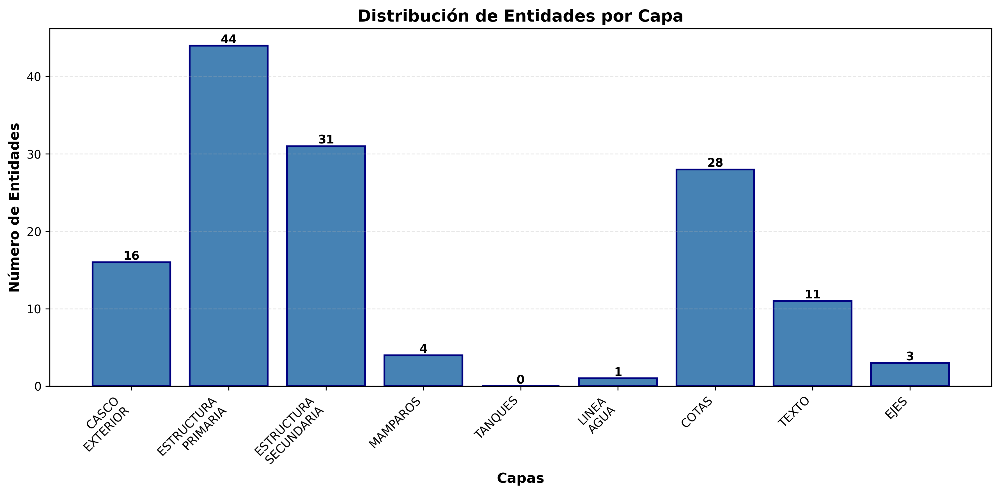
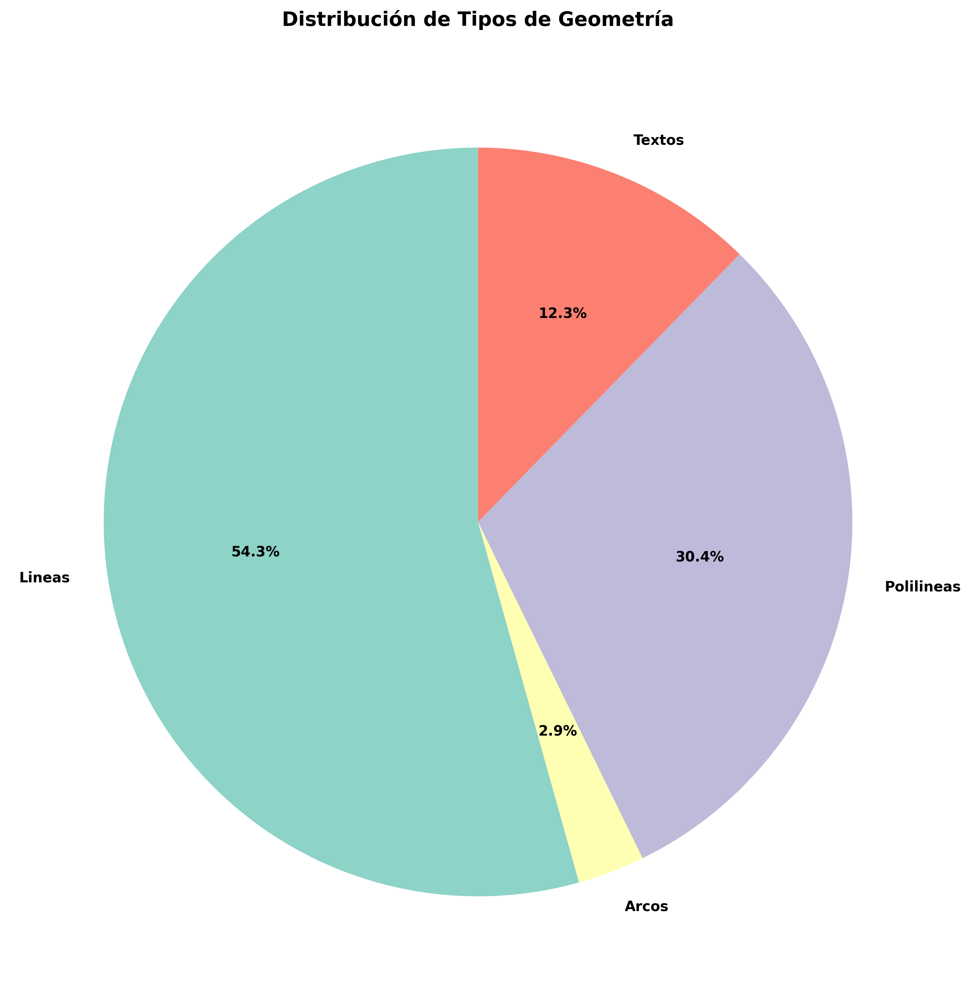
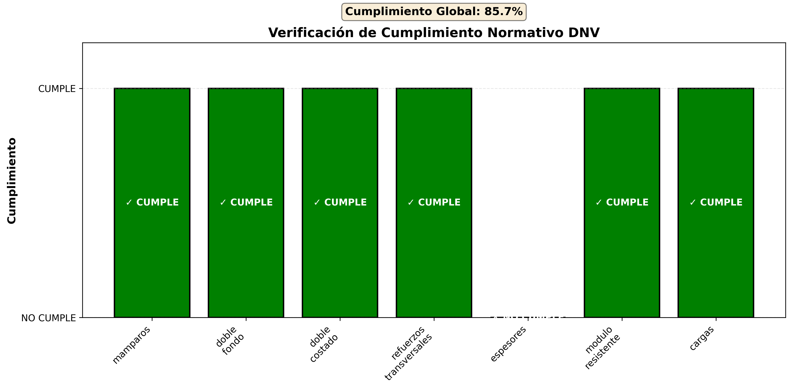

# REPORTE DE ANÁLISIS - CUADERNA MAESTRA
## Buque Grupo 9

**Fecha de análisis:** 2025-11-20 09:25:44

---

## 1. RESUMEN EJECUTIVO

### Estado General
- **Análisis de Plano:** APROBADO
- **Verificación DNV:** REQUIERE CORRECCIONES
- **Cumplimiento Normativo:** 85.7%

### Errores y Advertencias
- **Errores detectados:** 0
- **Advertencias:** 1

---

## 2. ANÁLISIS DEL PLANO

### 2.1 Información del Archivo
- **Archivo:** salidas/ENTREGA 3 v4/Corte_Transversal_Cuaderna_Maestra_Detallado.dxf
- **Fecha de análisis:** 2025-11-20T09:25:43.939635

### 2.2 Capas Encontradas

| Capa | Existe | Entidades | Tipos |
|------|--------|-----------|-------|
| CASCO_EXTERIOR | ✓ | 16 | LINE, ARC |
| ESTRUCTURA_PRIMARIA | ✓ | 44 | LINE, LWPOLYLINE |
| ESTRUCTURA_SECUNDARIA | ✓ | 31 | LWPOLYLINE |
| MAMPAROS | ✓ | 4 | LINE |
| TANQUES | ✓ | 0 |  |
| LINEA_AGUA | ✓ | 1 | LINE |
| COTAS | ✓ | 28 | LINE, TEXT |
| TEXTO | ✓ | 11 | TEXT, LWPOLYLINE, MTEXT |
| EJES | ✓ | 3 | LINE |

### 2.3 Geometría

- **Líneas:** 75
- **Arcos:** 4
- **Círculos:** 0
- **Polilíneas:** 42
- **Splines:** 0
- **Textos:** 17
- **Cotas:** 0

### 2.4 Dimensiones

- **Manga estimada:** 22.65 m
- **Puntal estimado:** 11.35 m

---

## 3. VERIFICACIÓN NORMATIVA DNV

### 3.1 Resultados de Verificación

| Verificación | Estado | Normativa |
|--------------|--------|----------|
| Mamparos | ✓ CUMPLE | DNV Pt.3 Ch.2 Sec.2 |
| Doble Fondo | ✓ CUMPLE | DNV Pt.3 Ch.2 Sec.3 |
| Doble Costado | ✓ CUMPLE | SOLAS II-1 Reg.13 |
| Refuerzos Transversales | ✓ CUMPLE | DNV Pt.3 Ch.3 Sec.2-3 |
| Espesores | ✗ NO CUMPLE | DNV Pt.3 Ch.3 Sec.4 |
| Modulo Resistente | ✓ CUMPLE | DNV Pt.3 Ch.3 Sec.2 |
| Cargas | ✓ CUMPLE | DNV Pt.3 Ch.5 Sec.1-2 |

### 3.2 Detalles de Verificaciones

#### Mamparos

- **Normativa:** DNV Pt.3 Ch.2 Sec.2
- **Descripción:** Disposición de mamparos estancos
- **Estado:** ✓ CUMPLE

#### Doble Fondo

- **Normativa:** DNV Pt.3 Ch.2 Sec.3
- **Descripción:** Altura de doble fondo
- **Estado:** ✓ CUMPLE

**Valores:**
- Minimo M: 0.799
- Real M: 1.2
- Maximo M: 2.0

#### Doble Costado

- **Normativa:** SOLAS II-1 Reg.13
- **Descripción:** Ancho de doble costado
- **Estado:** ✓ CUMPLE

**Valores:**
- Minimo M: 1.066
- Real M: 1.8

#### Refuerzos Transversales

- **Normativa:** DNV Pt.3 Ch.3 Sec.2-3
- **Descripción:** Espaciamiento de refuerzos transversales
- **Estado:** ✓ CUMPLE

**Valores:**
- Espaciamiento M: 0.7
- Maximo M: 0.7

#### Espesores

- **Normativa:** DNV Pt.3 Ch.3 Sec.4
- **Descripción:** Espesores de costados y cubiertas
- **Estado:** ✗ NO CUMPLE

**Valores:**

*Forro:*
  - Minimo Mm: 23.7
  - Real Mm: 12.0
  - Cumple: False

*Cubierta:*
  - Minimo Mm: 9.2
  - Real Mm: 10.0
  - Cumple: True

#### Modulo Resistente

- **Normativa:** DNV Pt.3 Ch.3 Sec.2
- **Descripción:** Módulo resistente de la cuaderna
- **Estado:** ✓ CUMPLE

**Valores:**
- Requerido Cm3: 0.02
- Real Cm3: 2500.0
- Margen Pct: 13796524.8

#### Cargas

- **Normativa:** DNV Pt.3 Ch.5 Sec.1-2
- **Descripción:** Casos de carga estructural
- **Estado:** ✓ CUMPLE

**Valores:**
- Presion Hidrostatica Kpa: 0.06
- Presion Cubierta Kpa: 10.0
- Presion Total Kpa: 10.06

---

## 4. CONCLUSIONES Y RECOMENDACIONES

### 4.1 Conclusiones

⚠ La cuaderna maestra requiere correcciones para cumplir con la normativa DNV.

### 4.2 Recomendaciones

**Advertencias del análisis de plano:**
- No se encontraron cotas en el plano

**Verificaciones que no cumplen:**
- Espesores

---

## 5. ANEXOS

### 5.1 Archivos Generados

- **Análisis de plano:** `analisis_plano_cuaderna.json`
- **Verificación DNV:** `verificacion_dnv_cuaderna.json`
- **Gráficos:** `graficos/`
- **Tablas:** `tablas/`

### 5.2 Referencias Normativas

- DNV Pt.3 Ch.2 Sec.2: Disposición de mamparos estancos
- DNV Pt.3 Ch.2 Sec.3: Doble fondo y doble costado
- DNV Pt.3 Ch.3 Sec.2-3: Dimensionamiento de refuerzos transversales
- DNV Pt.3 Ch.3 Sec.4: Espesores de costados y cubiertas
- DNV Pt.3 Ch.5 Sec.1-2: Casos de carga estructural
- SOLAS II-1 Reg.13: Integridad de mamparos
- SOLAS II-1 Reg.26: Seguridad de maquinaria

---

**Generado automáticamente por el Sistema de Análisis de Cuadernas**
