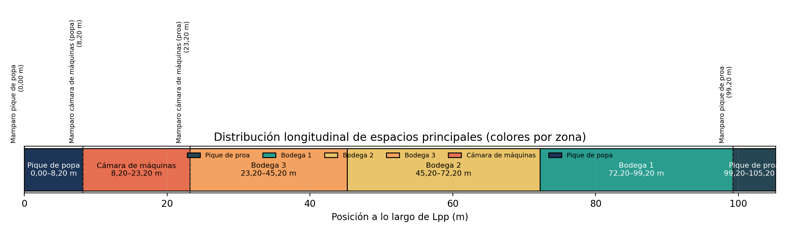

# Anexo: Figura 01 – Distribución longitudinal

**Descripción:**
Vista longitudinal del buque mostrando la disposición de mamparos, bodegas y espacios principales según la segmentación final (LPP=105,2 m).
