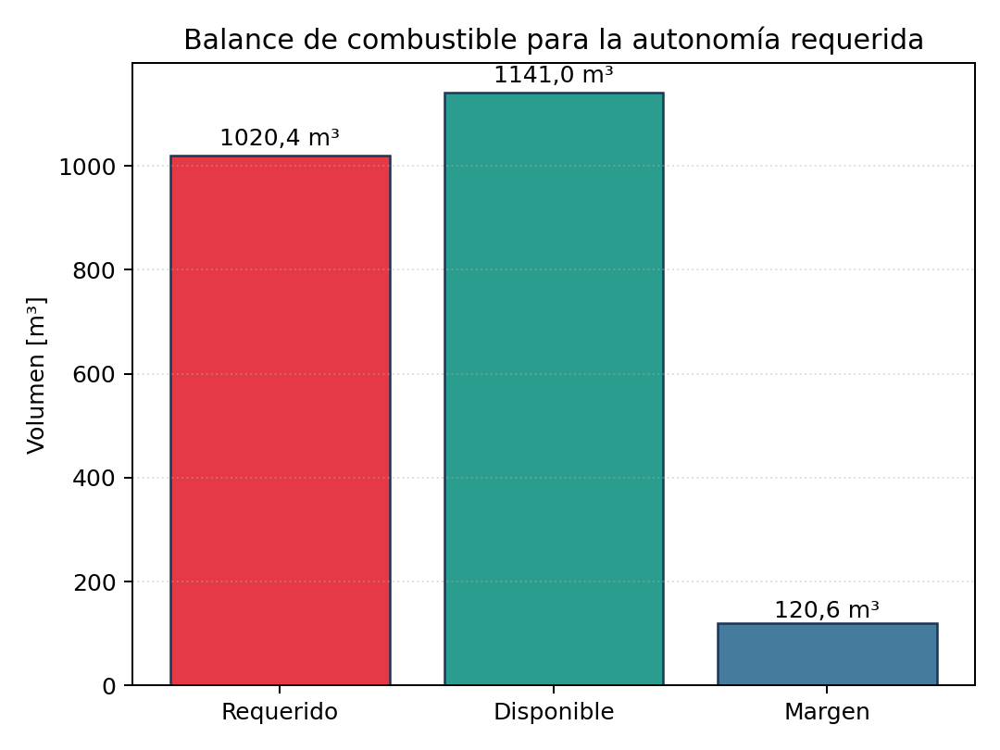

# Anexo: Figura 03 – Balance de combustible

**Descripción:**
Gráfico de barras mostrando el balance entre el volumen requerido y el volumen disponible de combustible para 30 días de autonomía, considerando todos los tanques y márgenes operativos.
