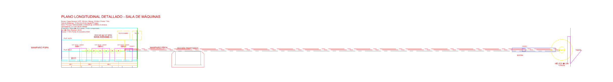

# Plano Longitudinal 2D – Sala de Máquinas

Documento maestro del plano longitudinal de la cámara de máquinas (vista por crujía) con foco en requisitos 2D antes de pasar al modelo volumétrico superior.

---

## 1. Entregables y referencias visuales

| Archivo | Propósito | Cómo abrir |
| --- | --- | --- |
| `salidas/disposicion_general/Plano_Longitudinal_Sala_Maquinas_Detallado.dxf` | Fuente CAD principal (R2010) | AutoCAD, LibreCAD, QCAD, DraftSight |
| `salidas/disposicion_general/Plano_Longitudinal_Sala_Maquinas_Detallado.html` | Visor SVG interactivo | `open salidas/disposicion_general/Plano_Longitudinal_Sala_Maquinas_Detallado.html` |
| `salidas/disposicion_general/Plano_Longitudinal_Sala_Maquinas_Detallado.png` | Imagen real exportada desde el DXF (3600×1500 px) | Cualquier visor de imágenes |



---

## 2. Parámetros básicos del plano

| Parámetro | Valor |
| --- | --- |
| Estación longitudinal cubierta por la cámara | 8.2 m – 23.2 m desde PP de popa |
| Dimensiones en vista | 102.7 m (X) × 7.9 m (Z) |
| Alturas clave | Doble fondo 1.20 m · Plataforma baja 3.20 m · Plataforma alta 5.50 m · Cubierta principal 7.90 m |
| Tanques principales | DB total 149.96 m³ · 2× Wing tanks 113.31 m³ c/u |
| Equipos principales | MAN 6S50ME-C · 3× CAT 3512C · caldera auxiliar · bombas FO/LO/SW |
| Norma de referencia | DNV Pt.3 Ch.2 Sec.3 · SOLAS Cap. II-1 |

---

## 3. Orden constructivo del plano 2D

1. **Estructura primaria**
   - Quilla, varengas y perfil del casco (capas `CASCO` y `Estructura`).
   - Mamparos estancos en x = 8.2 m (popa) y x = 23.2 m (proa).
2. **Subestructura y cubiertas**
   - Doble fondo con altura normativa 1.20 m y compartimentos DB-1…DB-4.
   - Cubiertas: tank top (2.0 m), plataforma intermedia (4.5 m), cubierta principal (7.9 m).
3. **Tanques y cofferdams**
   - DB continuo como reserva + lastre, wing tanks triangulares (factores DNV 0.92 y 0.88).
   - Tanques de servicio FO/LO y day tank dentro de la sala.
4. **Fundaciones**
   - Zócalo longitudinal del motor (600 mm), apoyos de generadores, bases de bombas y caldera.
5. **Leyenda y acotado**
   - Dimensiones longitudinales clave, alturas, referencias PP y línea base.

---

## 4. Sistema propulsor diésel representado

| Elemento | Detalle |
| --- | --- |
| Motor principal | MAN 6S50ME-C · 8.5 × 3.2 × 4.1 m · 6 cilindros visibles · eje cigüeñal a 4.0 m |
| Línea de ejes | Ø0.45 m con bocina de Ø0.80 m y 2 chumaceras (x = 12.4 m y 18.4 m) |
| Hélice | 4 palas Ø4.20 m · timón semi-balanceado 5.5 × 2.8 m |
| Servicios | Tuberías FO Ø200 mm · SW Ø300 mm · ventilación y escape superior |

*Nota:* la imagen PNG adjunta proviene directamente del DXF y sirve como visualización fiel del propulsor y su anclaje dentro del doble fondo.

---

## 5. Equipos auxiliares y servicios

- **Generadores CAT 3512C** (x3) ubicados a 9.7 / 13.7 / 17.7 m, cada uno 3.0 × 1.6 × 2.5 m.
- **Caldera auxiliar** situada en popa (21.7 m).
- **Bombas** FO (9.2 m), LO (10.2 m) y SW (21.7 m) alineadas sobre la plataforma inferior.
- **Sistemas**: tuberías principales, ventilación, day tank, líneas de servicio, secciones de referencia para inspecciones.

---

## 6. Descarga de bloques e imágenes reales mediante API de AutoCAD (Autodesk Platform Services)

1. **Crear una app APS (Forge)**
   - https://forge.autodesk.com → Create App → habilitar scopes `data:read data:write bucket:create`.
2. **Obtener token y descargar modelos (ej. propulsor DWG)**

   ```bash
   # Token (client_credentials)
   curl -X POST https://developer.api.autodesk.com/authentication/v1/authenticate \
        -d "client_id=YOUR_ID&client_secret=YOUR_SECRET&grant_type=client_credentials&scope=data:read"

   # Descarga de un bloque DWG previamente cargado a OSS
   curl -L \
        -H "Authorization: Bearer <TOKEN>" \
        -o recursos/autocad/propulsor_man.dwg \
        "https://developer.api.autodesk.com/oss/v2/buckets/<bucket>/objects/propulsor_man.dwg"
   ```

3. **Insertar el bloque descargado desde AutoCAD (COM API)**

   ```python
   from integracion_autocad_motores import AutoCADEngineIntegration

   autocad = AutoCADEngineIntegration()
   if autocad.connect_autocad():
       autocad.doc.SendCommand(
           '-INSERT recursos/autocad/propulsor_man.dwg 12.0,2.5 1 1 0 '
       )
   ```

4. **Actualizar la documentación**
   - Colocar las referencias descargadas en `recursos/autocad/`.
   - Exportar nueva imagen (`python3 herramientas/exportar_dxf_a_png.py`) para reflejar el equipo real insertado.

Estos pasos permiten anexar imágenes/blocs reales del propulsor o del motor diésel directamente desde el repositorio cloud de AutoCAD y mantener la traza en el plano 2D.

---

## 7. Validación en AutoCAD (desktop o web)

1. Abrir el DXF con `RECOVER` o `AUDIT` para que AutoCAD repare tablas si fuera necesario.
2. Ejecutar `ZOOM` → `Extents` y luego `REGENALL` (el script ya configura `$EXTMIN/-MAX`, pero garantiza que el VPORT se actualice).
3. Alinear el sistema de coordenadas con `UCS` → `World` y confirmar que el trabajo se realice en **Model Space**.
4. Para depurar capas: `-LA` → `ON *` → `THAW *`.
5. Si persisten problemas de versión, convertir a DWG mediante **ODA File Converter** y volver a abrir.

---

## 8. Próximos pasos hacia el modelo superior

1. **Insertar los bloques descargados** (motor/propulsor reales) y regenerar el PNG para documentación.
2. **Añadir vistas complementarias** (planta y secciones) antes del paso a 3D.
3. **Sincronizar con el módulo COM** (`integracion_autocad_motores.py`) para automatizar cajetines, estilos y exportar a PDF.
4. **Modelado superior**: una vez consolidado el 2D, migrar a Maxsurf/AutoCAD 3D usando la misma biblioteca de motores descargada vía APS.

---

**Generado automáticamente por** `herramientas/generar_plano_longitudinal_detallado.py`  
**Última exportación de imagen:** `salidas/disposicion_general/Plano_Longitudinal_Sala_Maquinas_Detallado.png`
